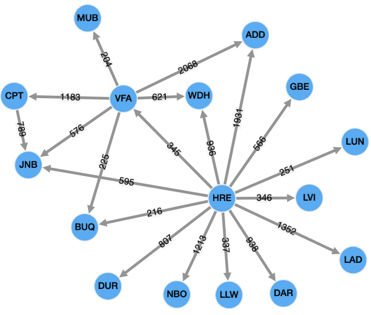

## Testing Neptune queries

This repository provides an approach to the automated testing of queries that have been written to
run against a property graph in Amazon Neptune. The code is written in Typescript, although the concept
can be extended to any language that can query a property graph.

The example code provided in this repository does not require any cloud resources to run, and can be 
executed entirely on a developers local environment, enabling functional testing of graph queries that
are written to run against Amazon Neptune, outside of the cloud.

The tests run against an Apache TinkerPop Gremlin Server (https://tinkerpop.apache.org/) which
supports both Gremlin and openCypher queries.

The tests load a set of test data to the graph before executing, which is a small subset
of Kelvin Lawrence's air route data set (https://github.com/krlawrence/graph/tree/master/sample-data).
The test data is illustrated below



### Running the tests

To run the test suite, execute the following command

```
make test
```

The test target will

- Install dependencies
- Start a docker container with a Gremlin Server database with the correct configuration to support Gremlin and openCypher tests
- Execute the test suites against the database
